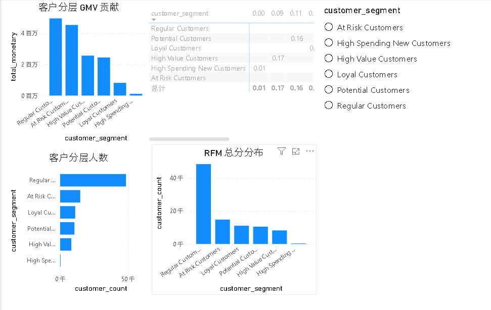
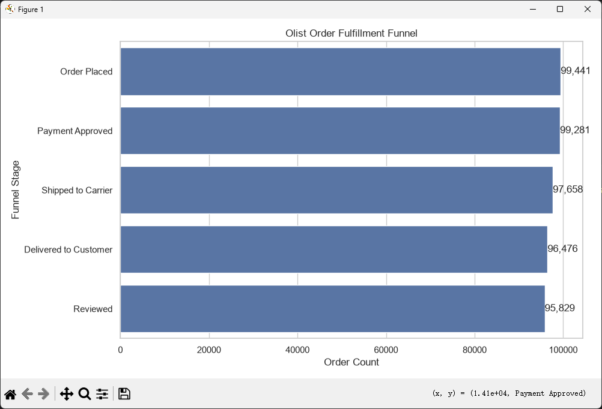

# Olist 巴西电商用户分层与履约分析项目

> 项目 · 2026-07-18

这个项目基于 Olist Brazilian E-Commerce Public Dataset，围绕 客户价值、订单履约 两个方向展开。

用 MySQL 构建 RFM 用户分层模型，用 Power BI 展示客户价值结构；用 Python 构建订单履约漏斗，分析从下单到评价的转化和耗时

## 一、项目背景

Olist 是巴西电商公开数据集，包含客户、订单、商品、支付、评价、卖家和地理位置等信息。相比只看销售额排名，我更关注两个业务问题：

- 哪些用户是高价值客户、潜力客户和流失风险客户？

- 订单从下单到评价的履约过程中，哪个环节存在流失或耗时？

## 二、数据表理解

原始数据集包含 9 张核心表：

- customers：客户信息，包含 customer_unique_id、城市、州。

- orders：订单主表，包含订单状态，以及下单、审批、发货、妥投、预计送达时间。

- order_items：订单商品明细，包含 price 和 freight_value。

- order_payments：支付方式、分期数和支付金额。

- order_reviews：订单评价，包含 review_score 和评价文本。

- products：商品品类、重量、长宽高等商品属性。

- sellers：卖家信息，包含卖家城市和州。

- category_translation：商品品类英文翻译。

- geolocation：邮编、城市、州和经纬度。

项目里最核心的关联关系是：

```
customers.customer_id = orders.customer_id
orders.order_id = order_items.order_id
orders.order_id = order_reviews.order_id
order_items.product_id = products.product_id
order_items.seller_id = sellers.seller_id
```

做用户分析时，使用 customer_unique_id 作为用户唯一标识，而不是 customer_id。因为 customer_id 更像一次订单中的客户记录，customer_unique_id 更接近真实用户身份。

## 三、分析口径

为了保证指标一致，先定义了几个核心口径：

- 完成订单：order_status = 'delivered'

- 用户粒度：customer_unique_id

- GMV：商品金额 price + 运费 freight_value

- RFM 分析基准日：数据集中 delivered 订单的最大下单日期

- 履约漏斗：下单 -> 审批通过 -> 发货 -> 妥投 -> 评价

Olist 数据集中没有浏览、加购、收藏等前端行为数据，所以没有强行构建传统电商前端漏斗，而是基于订单生命周期字段构建订单履约漏斗。

## 四、SQL + Power BI：RFM 用户分层

RFM 模型用于识别不同价值层级的用户：

- R：Recency，距离最近一次购买过去多少天。

- F：Frequency，用户完成订单次数。

- M：Monetary，用户累计消费金额。

核心 SQL 如下：

```sql
WITH rfm_base AS (
    SELECT
        c.customer_unique_id,
        MAX(o.order_purchase_timestamp) AS last_purchase_date,
        DATEDIFF(
            (SELECT MAX(order_purchase_timestamp)
             FROM orders
             WHERE order_status = 'delivered'),
            MAX(o.order_purchase_timestamp)
        ) AS recency_days,
        COUNT(DISTINCT o.order_id) AS frequency,
        SUM(oi.price + oi.freight_value) AS monetary
    FROM orders o
    JOIN customers c
        ON o.customer_id = c.customer_id
    JOIN order_items oi
        ON o.order_id = oi.order_id
    WHERE o.order_status = 'delivered'
    GROUP BY c.customer_unique_id
),
rfm_score AS (
    SELECT
        customer_unique_id,
        last_purchase_date,
        recency_days,
        frequency,
        monetary,
        6 - NTILE(5) OVER (ORDER BY recency_days ASC) AS r_score,
        NTILE(5) OVER (ORDER BY frequency ASC) AS f_score,
        NTILE(5) OVER (ORDER BY monetary ASC) AS m_score
    FROM rfm_base
),
rfm_segment AS (
    SELECT
        customer_unique_id,
        last_purchase_date,
        recency_days,
        frequency,
        ROUND(monetary, 2) AS monetary,
        r_score,
        f_score,
        m_score,
        CONCAT(r_score, f_score, m_score) AS rfm_score,
        r_score + f_score + m_score AS rfm_total_score,
        CASE
            WHEN r_score >= 4 AND f_score >= 4 AND m_score >= 4
                THEN 'High Value Customers'
            WHEN r_score >= 4 AND f_score >= 4
                THEN 'Loyal Customers'
            WHEN r_score >= 4 AND f_score <= 2 AND m_score >= 4
                THEN 'High Spending New Customers'
            WHEN r_score >= 4 AND m_score >= 3
                THEN 'Potential Customers'
            WHEN r_score <= 2 AND (f_score >= 4 OR m_score >= 4)
                THEN 'At Risk Customers'
            ELSE 'Regular Customers'
        END AS customer_segment
    FROM rfm_score
)
SELECT *
FROM rfm_segment;
```

RFM 分层规则不是简单看总分，而是结合 R/F/M 的组合含义：

- High Value Customers：最近购买、购买频次高、消费金额高。

- Loyal Customers：最近购买且复购较多。

- High Spending New Customers：最近购买、消费金额高，但频次较低。

- Potential Customers：近期活跃且消费潜力较高。

- At Risk Customers：历史价值较高，但近期活跃度下降。

- Regular Customers：普通客户。

Power BI 看板主要展示：

- 总客户数

- 总 GMV

- 平均消费金额

- 平均 Recency

- 各分层客户数

- 各分层 GMV 贡献

- RFM 总分分布

- 分层筛选器



*Power BI RFM 用户分层看板*

## 五、Python：订单履约漏斗分析

主要分析订单从下单到评价的流转情况。

使用 SQLAlchemy 连接 MySQL，读取订单生命周期字段和评价标记：

```python
import os
import pandas as pd
import matplotlib.pyplot as plt
import seaborn as sns
from sqlalchemy import create_engine

MYSQL_USER = os.getenv("MYSQL_USER", "root")
MYSQL_PASSWORD = os.getenv("MYSQL_PASSWORD")
MYSQL_HOST = os.getenv("MYSQL_HOST", "localhost")
MYSQL_DB = os.getenv("MYSQL_DB", "olist_brazil")

engine = create_engine(
    f"mysql+pymysql://{MYSQL_USER}:{MYSQL_PASSWORD}@{MYSQL_HOST}:3306/{MYSQL_DB}"
)

sql = """
SELECT
    o.order_id,
    o.order_status,
    o.order_purchase_timestamp,
    o.order_approved_at,
    o.order_delivered_carrier_date,
    o.order_delivered_customer_date,
    o.order_estimated_delivery_date,
    CASE
        WHEN r.order_id IS NOT NULL THEN 1
        ELSE 0
    END AS has_review
FROM orders o
LEFT JOIN (
    SELECT DISTINCT order_id
    FROM order_reviews
) r
    ON o.order_id = r.order_id;
"""

orders = pd.read_sql(sql, engine)
```

漏斗阶段定义如下：

- Order Placed：存在下单时间。

- Payment Approved：存在审批通过时间。

- Shipped to Carrier：存在发货给承运商时间。

- Delivered to Customer：存在妥投时间。

- Reviewed：已妥投且存在评价。

核心计算逻辑：

```python
total_orders = len(orders)

placed = orders["order_purchase_timestamp"].notna().sum()
approved = orders["order_approved_at"].notna().sum()
shipped = orders["order_delivered_carrier_date"].notna().sum()
delivered = orders["order_delivered_customer_date"].notna().sum()
reviewed = (
    orders["order_delivered_customer_date"].notna()
    & (orders["has_review"] == 1)
).sum()

funnel = pd.DataFrame({
    "stage": [
        "Order Placed",
        "Payment Approved",
        "Shipped to Carrier",
        "Delivered to Customer",
        "Reviewed"
    ],
    "order_count": [
        placed,
        approved,
        shipped,
        delivered,
        reviewed
    ]
})

funnel["overall_conversion_rate"] = funnel["order_count"] / total_orders
funnel["step_conversion_rate"] = funnel["order_count"] / funnel["order_count"].shift(1)
funnel.loc[0, "step_conversion_rate"] = 1
```

履约耗时分析包括：

- 下单到审批耗时

- 审批到发货耗时

- 发货到妥投耗时

- 下单到妥投总耗时

```python
orders["approval_hours"] = (
    orders["order_approved_at"] - orders["order_purchase_timestamp"]
).dt.total_seconds() / 3600

orders["ship_days"] = (
    orders["order_delivered_carrier_date"] - orders["order_approved_at"]
).dt.total_seconds() / 86400

orders["delivery_days"] = (
    orders["order_delivered_customer_date"] - orders["order_delivered_carrier_date"]
).dt.total_seconds() / 86400

orders["total_delivery_days"] = (
    orders["order_delivered_customer_date"] - orders["order_purchase_timestamp"]
).dt.total_seconds() / 86400
```

用 seaborn 绘制漏斗图：

```python
sns.set_theme(style="whitegrid")

plt.figure(figsize=(10, 6))
ax = sns.barplot(
    data=funnel,
    x="order_count",
    y="stage",
    color="#4C78A8"
)

for i, row in funnel.iterrows():
    ax.text(
        row["order_count"],
        i,
        f'{int(row["order_count"]):,}',
        va="center",
        ha="left"
    )

ax.set_title("Olist Order Fulfillment Funnel")
ax.set_xlabel("Order Count")
ax.set_ylabel("Funnel Stage")

plt.tight_layout()
plt.show()
```



*Python 订单履约漏斗图*

## 七、项目结论

这个项目的结论可以概括为三点：

- RFM 模型可以将用户从订单记录转化为可运营的人群标签，帮助识别高价值客户、高消费新客和流失风险客户。

- 履约漏斗可以观察订单从下单到评价的完整流程，帮助定位流失节点和主要耗时环节。

- 城市市场分析不能只看 GMV，还需要结合配送时效、延迟率和评分，识别高价值但体验有风险的重点城市。

- 在 Power BI 中整合用户分层看板。
