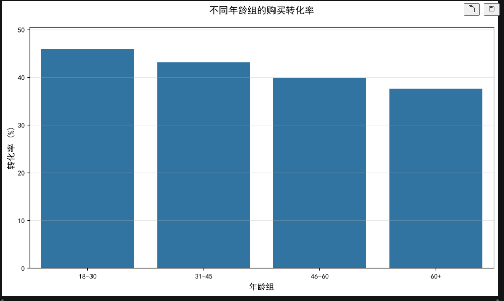
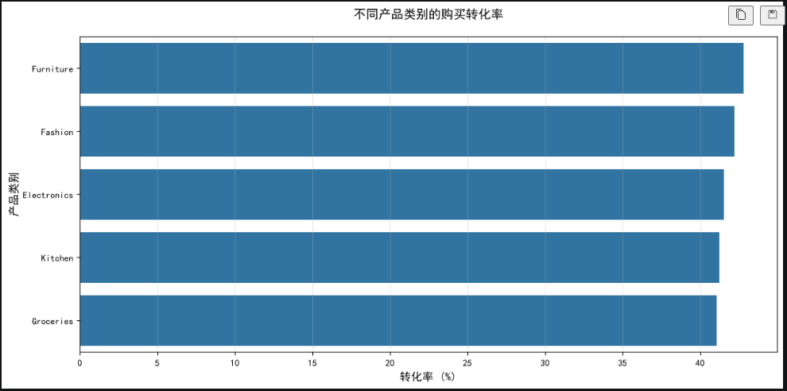
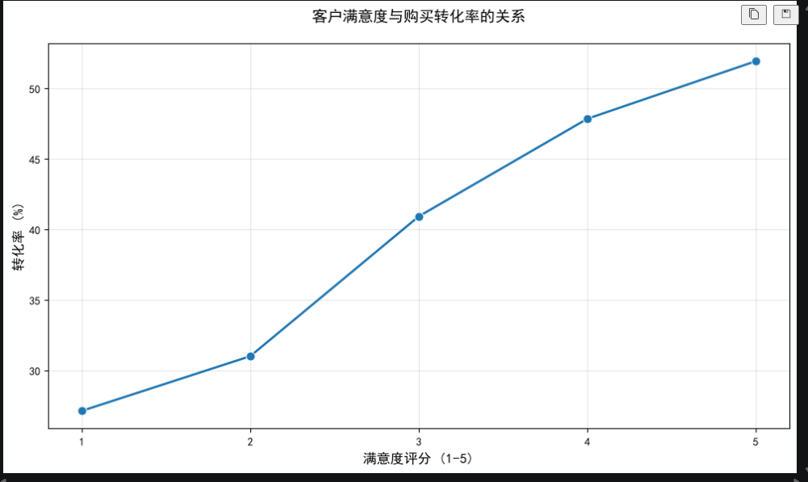

# 电商客户购买转化分析项目

> 项目 · 2026-07-18

## 项目背景

本项目基于 50 万条电商客户行为与画像数据，围绕“哪些客户更容易完成购买转化”展开分析。数据包含年龄、年收入、历史购买次数、网站停留时间、客户年限、产品类别、访问来源、会员计划、满意度以及是否购买等字段。

从客户特征和行为维度解释购买转化差异，为后续运营投放、人群分层和客户体验优化提供依据。

## 数据说明

核心数据文件为 customerData_500k.csv，原始数据共 500,000 条记录。目标字段为 PurchaseStatus，其中 1 表示客户完成购买，0 表示客户未购买。

主要字段包括：

| 字段 | 含义 |

| ---|--- | Age |

| 年龄 | AnnualIncome |

| 年收入 | NumberOfPurchases |

| 历史购买次数 | TimeSpentOnWebsite |

| 网站停留时间 | CustomerTenureYears |

| 客户年限 | LastPurchaseDaysAgo |

| 距上次购买天数 | Gender |

| 性别 | ProductCategory |

| 产品类别 | PreferredDevice |

| 偏好设备 | Region |

| 地区 | ReferralSource |

| 来源渠道 | CustomerSegment |

| 客户分层 | LoyaltyProgram |

| 是否加入会员计划 | DiscountsAvailed |

| 使用折扣次数 | SessionCount |

| 访问次数 | CustomerSatisfaction |

| 客户满意度 | PurchaseStatus |

## SQL 数据清洗思路

在 SQL 阶段，主要完成异常值处理、缺失值检查和基础转化率统计。把数据先处理到可以分析的状态。

```sql
USE customer_purchase;

-- 1. 删除年龄异常或收入异常的记录
DELETE FROM customer_purchase
WHERE Age < 18
   OR Age > 80
   OR AnnualIncome <= 0;

-- 2. 检查关键字段缺失情况
SELECT
    COUNT(*) AS total_records,
    SUM(CASE WHEN Age IS NULL THEN 1 ELSE 0 END) AS age_missing,
    SUM(CASE WHEN AnnualIncome IS NULL THEN 1 ELSE 0 END) AS income_missing,
    SUM(CASE WHEN Gender IS NULL THEN 1 ELSE 0 END) AS gender_missing
FROM customer_purchase;

-- 3. 计算年收入中位数，用于填补缺失值
WITH ranked_data AS (
    SELECT
        AnnualIncome,
        ROW_NUMBER() OVER (ORDER BY AnnualIncome) AS row_id,
        COUNT(*) OVER () AS total_rows
    FROM customer_purchase
    WHERE AnnualIncome IS NOT NULL
)
SELECT AVG(AnnualIncome) AS median_income
FROM ranked_data
WHERE row_id IN (
    FLOOR((total_rows + 1) / 2),
    CEIL((total_rows + 1) / 2)
);

-- 4. 使用中位数填补年收入缺失值
UPDATE customer_purchase
SET AnnualIncome = 83752
WHERE AnnualIncome IS NULL;

-- 5. 查询性别众数
SELECT Gender, COUNT(*) AS customer_count
FROM customer_purchase
WHERE Gender IS NOT NULL
GROUP BY Gender
ORDER BY customer_count DESC
LIMIT 1;

-- 6. 使用众数填补性别缺失值
UPDATE customer_purchase
SET Gender = 'Male'
WHERE Gender IS NULL;

-- 7. 计算整体购买转化率
SELECT
    COUNT(*) AS total_customers,
    SUM(PurchaseStatus) AS purchased_customers,
    ROUND(SUM(PurchaseStatus) / COUNT(*) * 100, 2) AS conversion_rate
FROM customer_purchase;

-- 8. 按年龄组计算购买转化率
SELECT
    CASE
        WHEN Age BETWEEN 18 AND 30 THEN '18-30'
        WHEN Age BETWEEN 31 AND 45 THEN '31-45'
        WHEN Age BETWEEN 46 AND 60 THEN '46-60'
        ELSE '60+'
    END AS age_group,
    COUNT(*) AS customer_count,
    ROUND(AVG(PurchaseStatus) * 100, 2) AS conversion_rate
FROM customer_purchase
GROUP BY age_group
ORDER BY conversion_rate DESC;

-- 9. 按产品类别计算购买转化率
SELECT
    ProductCategory,
    COUNT(*) AS customer_count,
    ROUND(AVG(PurchaseStatus) * 100, 2) AS conversion_rate
FROM customer_purchase
GROUP BY ProductCategory
ORDER BY conversion_rate DESC;

-- 10. 按客户满意度计算购买转化率
SELECT
    CustomerSatisfaction,
    COUNT(*) AS customer_count,
    ROUND(AVG(PurchaseStatus) * 100, 2) AS conversion_rate
FROM customer_purchase
GROUP BY CustomerSatisfaction
ORDER BY CustomerSatisfaction;
```

## Python 分析代码

用于数据清洗、特征分组、转化率计算和可视化。相比 SQL，Python 更适合快速探索不同维度下的转化差异，并输出图表。

```python
import pandas as pd
import matplotlib.pyplot as plt
import seaborn as sns

plt.rcParams['font.sans-serif'] = ['SimHei']
plt.rcParams['axes.unicode_minus'] = False

# 1. 读取数据
df = pd.read_csv(r"C:\Users\wc\Desktop\新建文件夹\archive (1)\customerData_500k.csv")

# 2. 删除年龄和收入异常记录
df = df[~((df['Age'] < 18) | (df['Age'] > 80) | (df['AnnualIncome'] <= 0))]

# 3. 检查关键字段缺失值
print("总记录数:", len(df))
print("Age 缺失数:", df['Age'].isnull().sum())
print("AnnualIncome 缺失数:", df['AnnualIncome'].isnull().sum())
print("Gender 缺失数:", df['Gender'].isnull().sum())

# 4. 使用中位数和众数填补缺失值
income_median = df['AnnualIncome'].median()
gender_mode = df['Gender'].mode()[0]

df['AnnualIncome'] = df['AnnualIncome'].fillna(income_median)
df['Gender'] = df['Gender'].fillna(gender_mode)

# 5. 构建年龄组
df['AgeGroup'] = pd.cut(
    df['Age'],
    bins=[17, 30, 45, 60, 81],
    labels=['18-30', '31-45', '46-60', '60+']
)

# 6. 整体购买转化率
conversion_rate = df['PurchaseStatus'].mean() * 100
print(f"整体购买转化率: {conversion_rate:.2f}%")
```

## 年龄组转化率分析

清洗后保留 494,024 条有效样本，整体购买转化率为 41.79%。从年龄组看，18-30 岁客户转化率最高，为 45.87%；60 岁以上客户转化率最低，为 37.55%。这说明年轻客户在该数据集中表现出更强的购买意愿。



*不同年龄组的购买转化率*

```python
age_conversion = df.groupby('AgeGroup')['PurchaseStatus'].mean() * 100

plt.figure(figsize=(10, 6))
sns.barplot(x=age_conversion.index, y=age_conversion.values)
plt.title('不同年龄组的购买转化率', fontsize=14, pad=20)
plt.xlabel('年龄组', fontsize=12)
plt.ylabel('转化率 (%)', fontsize=12)
plt.ylim(0, max(age_conversion.values) * 1.1)
plt.grid(axis='y', alpha=0.3)
plt.tight_layout()
plt.show()

print(age_conversion.round(2))
```

年龄组结果：

| 年龄组 | 购买转化率 |

| ---|---: | 18-30 |

| 45.87% | 31-45 |

| 43.16% | 46-60 |

| 39.85% | 60+ |

## 产品类别转化率分析

从产品类别看，Furniture 和 Fashion 的购买转化率相对更高，分别为 42.83% 和 42.22%。Groceries 的转化率相对最低，为 41.06%。各品类之间差距不算极大，但仍可以为投放资源分配和首页推荐策略提供参考。



*不同产品类别的购买转化率*

```python
category_conversion = df.groupby('ProductCategory')['PurchaseStatus'].mean() * 100
category_conversion = category_conversion.sort_values(ascending=False)

plt.figure(figsize=(12, 6))
sns.barplot(x=category_conversion.values, y=category_conversion.index)
plt.title('不同产品类别的购买转化率', fontsize=14, pad=20)
plt.xlabel('转化率 (%)', fontsize=12)
plt.ylabel('产品类别', fontsize=12)
plt.grid(axis='x', alpha=0.3)
plt.tight_layout()
plt.show()

print(category_conversion.round(2))
```

产品类别结果：

| 产品类别 | 购买转化率 |

| ---|---: | Furniture |

| 42.83% | Fashion |

| 42.22% | Electronics |

| 41.56% | Kitchen |

| 41.22% | Groceries |

## 客户满意度与转化率关系

客户满意度和购买转化率呈明显正相关。满意度 1 分客户的转化率为 27.13%，满意度 5 分客户的转化率达到 51.93%。这说明客户体验很可能是影响购买转化的重要因素，运营侧可以优先关注低满意度客户的体验修复和高满意度客户的复购引导。



*客户满意度与购买转化率的关系*

```python
satisfaction_conversion = df.groupby('CustomerSatisfaction')['PurchaseStatus'].mean() * 100

plt.figure(figsize=(10, 6))
sns.lineplot(
    x=satisfaction_conversion.index,
    y=satisfaction_conversion.values,
    marker='o',
    linewidth=2,
    markersize=8
)
plt.title('客户满意度与购买转化率的关系', fontsize=14, pad=20)
plt.xlabel('满意度评分（1-5）', fontsize=12)
plt.ylabel('转化率 (%)', fontsize=12)
plt.grid(True, alpha=0.3)
plt.xticks(range(1, 6))
plt.tight_layout()
plt.show()

print(satisfaction_conversion.round(2))
```

满意度结果：

| 满意度评分 | 购买转化率 |

| ---|---: | 1 |

| 27.13% | 2 |

| 31.01% | 3 |

| 40.93% | 4 |

| 47.85% | 5 |

## 分析结论

1. 年轻客户转化率更高，18-30 岁客户购买转化率达到 45.87%，可以作为重点营销人群。

2. Furniture 和 Fashion 类目转化率相对领先，可作为活动资源和推荐位优先考虑的品类。

3. 客户满意度与购买转化率关系明显，满意度 5 分客户转化率比满意度 1 分客户高 24.80 个百分点。

4. 对低满意度客户，应优先排查商品体验、页面体验、售后服务和优惠策略；对高满意度客户，可以设计会员、复购券、个性化推荐等策略提升长期价值。
