# 电商用户行为分析项目

> 项目 · 2026-08 · Kaggle eCommerce Events History

## 项目背景

基于 Kaggle 2019 年 10–11 月电商用户行为日志（约 1.1 亿行），对用户行为做探索性分析（EDA）、数据清洗、转化漏斗 / 购买路径 / 复购 / RFM 分群，并基于 K-Means 对购买用户做聚类画像，输出可复现的 Python 脚本与图表。

## 运行方式

依赖见 `requirements.txt`（`np.bitwise_count` 需要 numpy>=2.0）。按顺序执行：

```bash
python eda.py
python clean.py
python behavior.py
python kmeans.py
```

`behavior.py` 会导出 `results/user_features.csv` 供 `kmeans.py` 读取，需按顺序运行；`--smoke` 参数只读前 3 个分块，用于快速冒烟测试。

## 数据与方法

数据：`2019-Oct.csv` + `2019-Nov.csv`（event_time / event_type / product_id / category_id / category_code / brand / price / user_id / user_session）
方法：pandas `chunksize=1,000,000` 分块读取，流式聚合，内存 O(唯一用户数)。
时间范围：2019-10-01 ~ 2019-11-30。

---

## 一、探索性数据分析（EDA）

### 1. 数据规模
| 文件 | 行数 | view | cart | purchase |
|---|---|---|---|---|
| Oct | 42,448,764 | 40,779,399 | 926,516 | 742,849 |
| Nov | 67,501,979 | 63,556,110 | 3,028,930 | 916,939 |
| **合计** | **109,950,743** | **104,335,509 (94.89%)** | **3,955,446 (3.60%)** | **1,659,788 (1.51%)** |

### 2. 缺失值（全量精确统计）
- `category_code` 缺失 35,413,780（32.21%）
- `brand` 缺失 15,341,158（13.95%）
- `user_session` 缺失 12（可忽略）；其余字段（event_time/event_type/product_id/category_id/price/user_id）无缺失。

### 3. price 探查
- 均值 291.63，中位数 164.88，P99 1714.07，max 2574.07。
- **price=0 共 256,761 行（0.23%）**，负值 0。购买事件 price 最小值 0.77（无 0 价成交）。

### 4. 转化率（事件级）
view→cart **3.79%**；cart→purchase **41.96%**；view→purchase **1.59%**。

### 5. 时间分析
- 每日购买量平稳（约 2~3 万/天），**11-17 是峰值（185,195）**，11-16（68,247）次之，11-29（32,107）第三。
- **11-11（双11）仅 24,931 次购买，并非峰值**；且 11-15 数据缺失 → 该数据集不是国内双11场景，是海外/无促销的自然分布。
- 购买时段峰值 **9:00（126,617）**，白天 5~16 时活跃，凌晨最低。

### 6. 用户分析
- 独立用户：Oct 3,022,290 / Nov 3,696,117 / 两月去重 5,316,649。
- 每用户行为次数：P50=5、P75=18、P90=51、P99=225（重度长尾）。
- 购买用户 697,470（13.12%）；仅浏览 4,619,179（86.88%）；复购率（购买用户中 ≥2 次）**42.34%**。

### 7. 商品分析
- 独立商品 206,876、品类 691、品牌 4,302。
- TOP 品类：electronics.smartphone（720,665 次购买）；TOP 品牌：samsung（372,923）、apple（308,937）、xiaomi（124,908）。
- 一级品类：electronics 购买 916,667、转化率 2.476% 领先；appliances、computers 次之。

### 8. 会话分析（抽样 2,338,927 会话）
- 每会话事件数：P50=2、P75=5、P90=11、P99=34。
- 路径：纯浏览 88.0%、浏览+加购(未购) 5.98%、浏览+加购+购买 4.02%、浏览+直接购买 2.00%。
- 会话时长：P50=0.98 分钟、P90=12.22 分钟、max 1253 分钟。

### 9. 数据质量
- 重复行（块内）130,738（0.119%）；user_id 空 0；price=0 256,761（0.234%）；price 负 0。

---

## 二、数据清洗

清洗规则：缺失填充 → 删 price<=0 → 删重复行 → 类型转换 → 品类拆分。

| 文件 | 原始行数 | 删 price<=0 | 删重复行 | 清洗后行数 | 保留比例 |
|---|---|---|---|---|---|
| Oct | 42,448,764 | 68,673 | 30,217 | 42,349,874 | 99.77% |
| Nov | 67,501,979 | 188,088 | 100,417 | 67,213,474 | 99.57% |
| **合计** | **109,950,743** | **256,761** | **130,634** | **109,563,348** | **99.65%** |

- 缺失填充：category_code→"unknown" 35,413,780 行；brand→"unknown" 15,341,158 行。
- 类型转换：event_time→datetime64；新增 cat_level1/2/3（category_code 按 `.` 拆分）。

---

## 三、用户行为分析

### 1. 转化漏斗（清洗后）
| 阶段 | 事件数 | 用户数 | 用户转化率 |
|---|---|---|---|
| view | 104,079,641 | 5,314,747 | 100% |
| cart | 3,824,004 | 1,053,550 | 19.82% |
| purchase | 1,659,703 | 697,470 | 66.20% |

事件级：view→cart 3.67%，cart→purchase 43.40%，view→purchase 1.60%。

### 2. 分品类漏斗 TOP5（购买量）
electronics > unknown > appliances > computers > apparel；electronics 购买 916,616、cart→purchase 43.1%。

### 3. 购买路径
纯浏览 77.70%、浏览→加购→购买 10.64%、加购后未购买 9.18%、浏览后直接购买 2.48%。

### 4. 复购分析
购买用户 697,470；复购（≥2 次）295,309，**复购率 42.34%**；复购客单价 316.14 vs 首购 267.46（复购用户价值更高）。

### 5. RFM 分群（购买用户，NTILE 五分制）
| 分群 | 人数 | 占比 | 平均购买次数 | 平均消费 |
|---|---|---|---|---|
| At Risk(流失风险) | 252,962 | 36.27% | 3.23 | 1013.4 |
| New(新客户) | 185,053 | 26.53% | 1.00 | 260.6 |
| Loyal(忠诚) | 179,699 | 25.76% | 2.27 | 592.2 |
| Champions(忠实高价值) | 53,730 | 7.70% | 4.14 | 1625.4 |
| Lost(已流失) | 26,026 | 3.73% | 1.00 | 260.8 |

---

## 四、用户分群（K-Means）

### 前置分层
全量 5,315,274 用户中，**未购买 4,617,804（86.88%）** vs 购买 697,470（13.12%）。
未购买用户占比过高会主导聚类，故作为天然一大段，仅对**购买用户**做 K-Means。

### 肘部法 / 轮廓系数（购买用户，K=2~8）
| K | 2 | 3 | 4 | 5 | 6 | 7 | 8 |
|---|---|---|---|---|---|---|---|
| silhouette | 0.518 | 0.398 | 0.403 | **0.419** | 0.390 | 0.378 | 0.367 |

3~5 类内 **K=5** 轮廓系数最高（0.419），选定 K=5。

### 聚类画像（含未购买大段）
| 类 | 标签 | 人数 | 占比 | 浏览 | 加购 | 购买 | 客单价 | 活跃天 |
|---|---|---|---|---|---|---|---|---|
| 未购买 | 未购买用户(纯浏览/加购未购) | 4,617,804 | 86.88% | 13.9 | 0.25 | 0 | 0 | 2.4 |
| 2 | 中低频低额买家 | 489,315 | 9.21% | 30.6 | 2.60 | 1.77 | 179.6 | 4.2 |
| 3 | 中高频低额买家 | 93,994 | 1.77% | 205.9 | 8.39 | 3.87 | 203.5 | 16.1 |
| 4 | 中频高额买家 | 81,790 | 1.54% | 28.9 | 3.23 | 2.15 | 957.5 | 4.5 |
| 0 | 低频低额买家 | 25,559 | 0.48% | 52.6 | 2.81 | 1.64 | 217.4 | 3.1 |
| 1 | 高频高额买家 | 6,812 | 0.13% | 270.9 | 41.5 | 31.0 | 356.7 | 20.5 |

### 核心结论
- 用户基本盘是 **86.88% 的未购买用户**（只浏览/加购）。
- 购买用户内部进一步分为 5 类：主流是「中低频低额买家」（70% 的买家、客单价 ~180），
  顶部是「高频高额买家」（人均购买 31 次、客单价 357，核心 VIP，仅 6,812 人）和
  「中频高额买家」（客单价高达 957，高客单人群）。
- 运营建议：对未购买用户做转化引导；对 At Risk 大群做召回；资源向 Champions + 高频高额/中频高额核心人群倾斜。

---

## 输出文件清单

**CSV（`results/`）**
- EDA：`eda_01_event_type分布` ~ `eda_09_数据质量汇总`（共 20 个）
- 清洗：`clean_01_清洗前后行数对比.csv`、`clean_02_缺失值填充统计.csv`
- 行为：`behavior_01_转化漏斗` ~ `behavior_05_RFM分群`、`rfm_purchasers.csv`、`user_features.csv`
- 分群：`kmeans_01_肘部法`、`kmeans_02_聚类画像`、`kmeans_03_聚类人数`

**图表（`results/plots/`，共 14 张）**
- EDA：事件类型分布 / 每日购买量 / 按小时购买量 / price分布 / 用户事件次数分布 / 一级品类购买量 / 会话时长分布
- 行为：转化漏斗 / 购买路径 / RFM分群
- 分群：肘部法 / 轮廓系数 / 画像对比 / PCA散点

**脚本**：`eda.py`、`clean.py`、`behavior.py`、`kmeans.py`（共享 `common.py`）

---

## 图表预览

### EDA

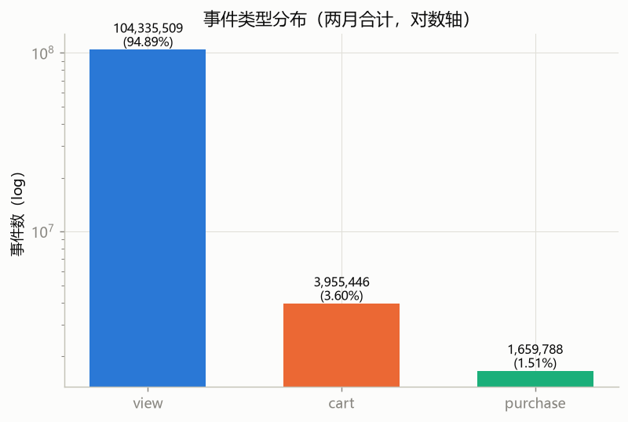
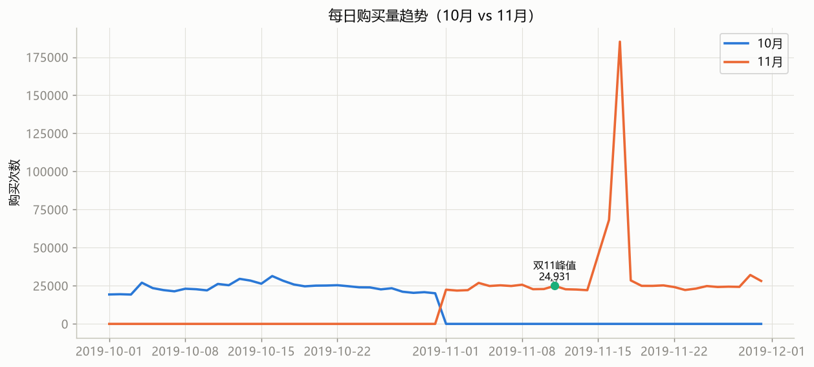
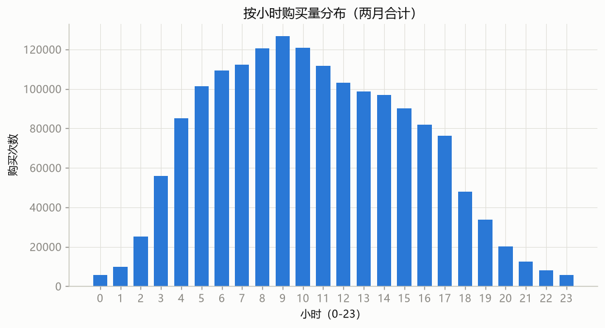
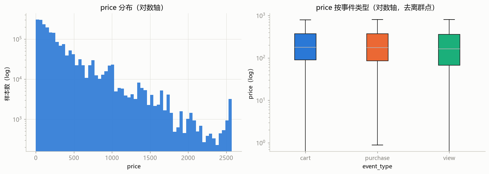
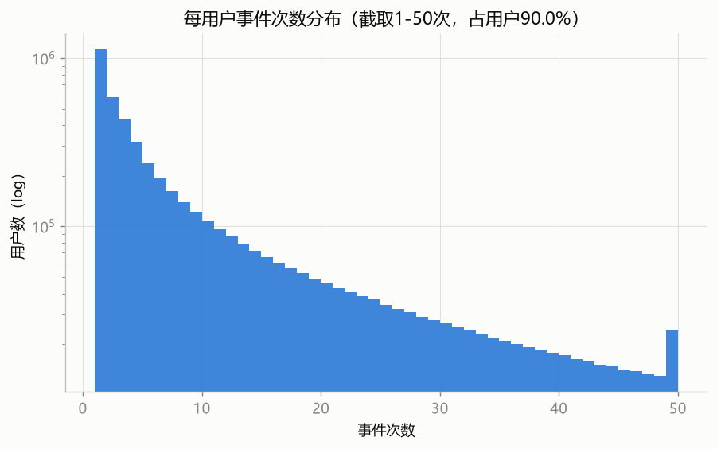
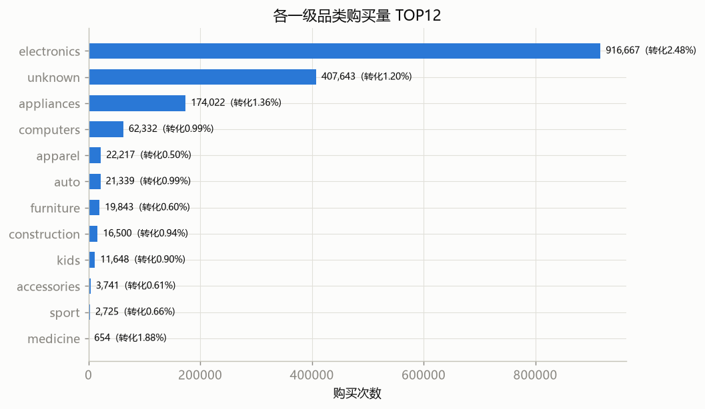
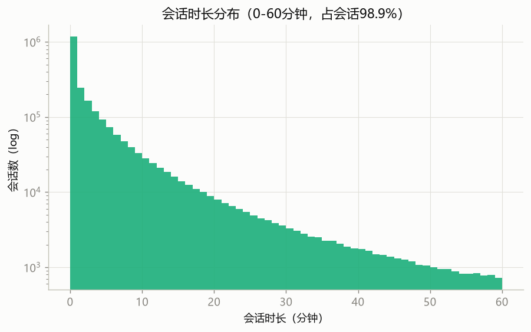

### 用户行为

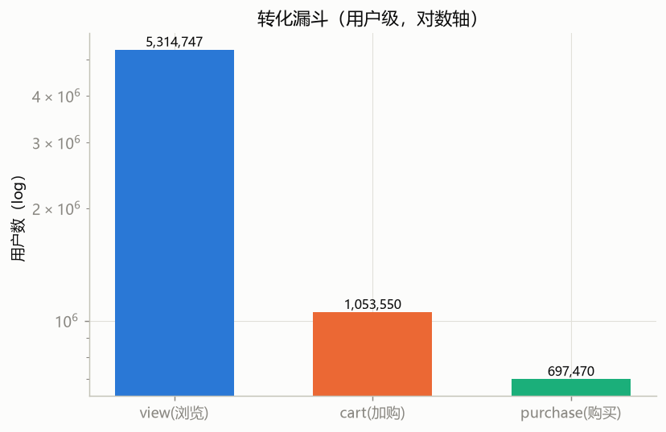
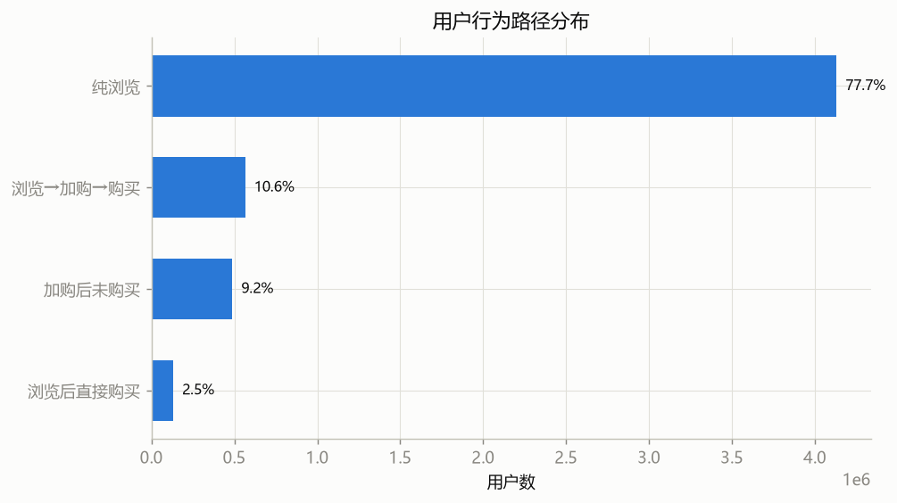
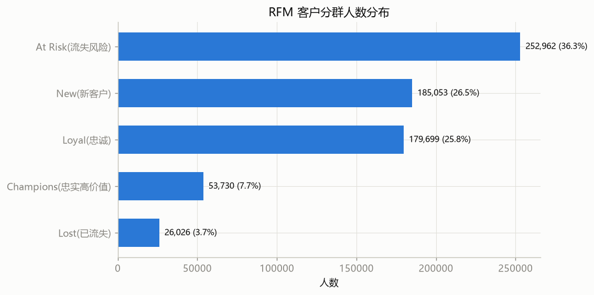

### 用户分群（K-Means）

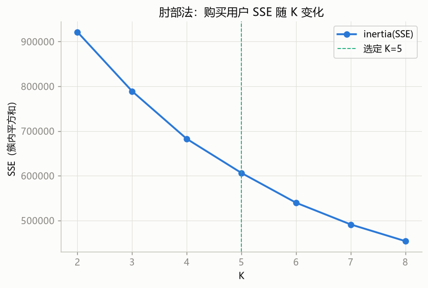
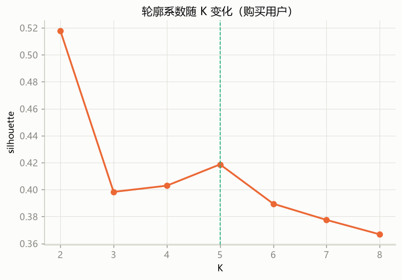
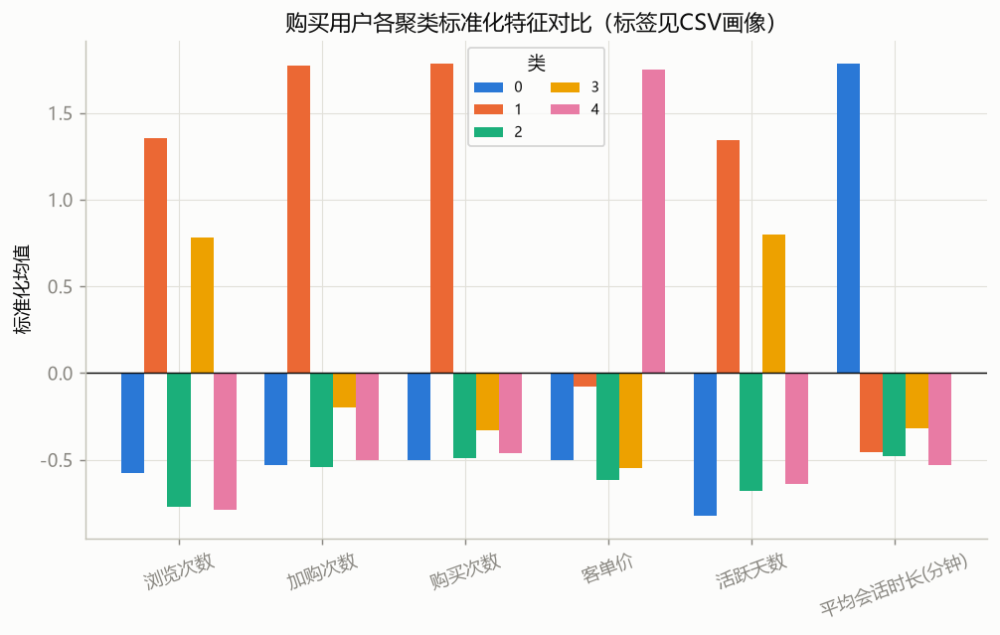
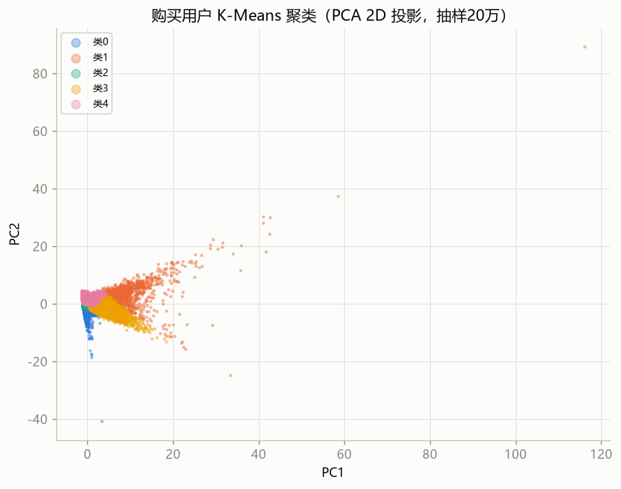
